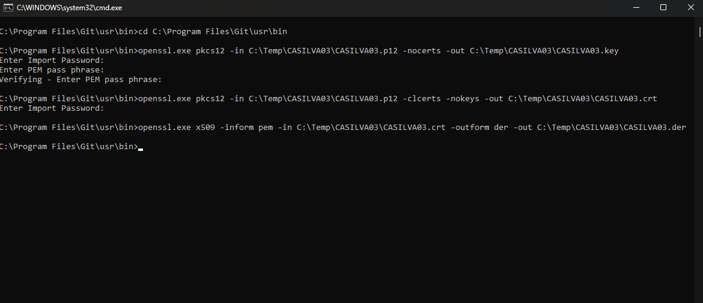
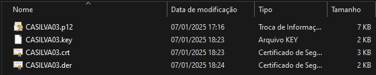

## Export private key using OpenSSL

Command

```console
openssl pkcs12 -in [yourfile.pfx] -nocerts -out [keyfile-encrypted.key]
```
  
Example

```console
cd C:\Program Files\Git\usr\bin
```
```console
openssl.exe pkcs12 -in C:\Temp\CASILVA03\CASILVA03.p12 -nocerts -out C:\Temp\CASILVA03\CASILVA03.key
```

## Export certificate OpenSSL

Command

```console
openssl pkcs12 -in [yourfile.pfx] -clcerts -nokeys -out [certificate.crt]
```
  
Example

```console
cd C:\Program Files\Git\usr\bin
```
```console
openssl.exe pkcs12 -in C:\Temp\CASILVA03\CASILVA03.p12 -clcerts -nokeys -out C:\Temp\CASILVA03\CASILVA03.crt
```

## Export certificate OpenSSL (DER)
Command

```console
openssl x509 -inform pem -in [yourfile.crt] -outform der -out [certificate.der]
```
  
Example

```console
cd C:\Program Files\Git\usr\bin
```
```console
openssl.exe x509 -inform pem -in C:\Temp\CASILVA03\CASILVA03.crt -outform der -out C:\Temp\CASILVA03\CASILVA03.der
```

## Execution


## Result
